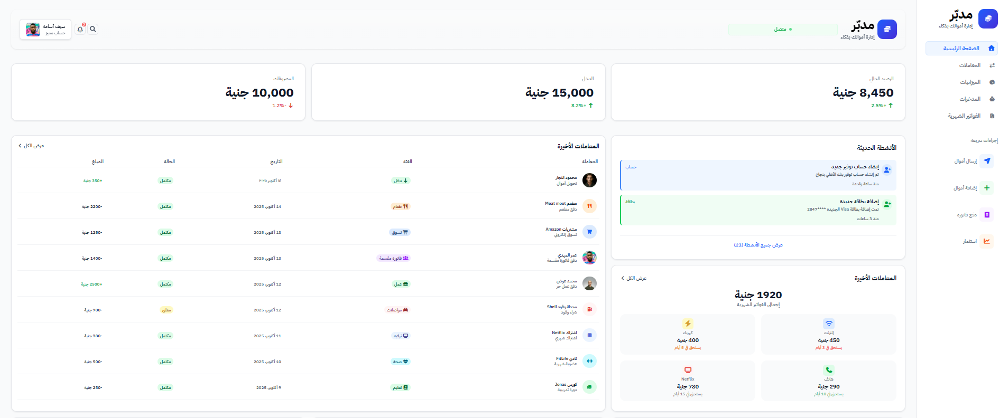
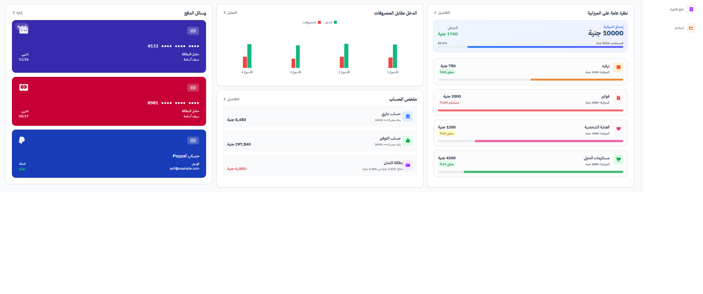

# 💰 Finance Dashboard

A modern and responsive **Finance Dashboard** for tracking income, expenses, and financial activity — built with **HTML**, **CSS**, and **Bootstrap 5.3.8**.

---

## 🚀 Live Demo  
👉 [finance-dashboard-page.netlify.app](https://finance-dashboard-page.netlify.app/)

---

## 📘 Overview  
The **Finance Dashboard** provides a clean and intuitive interface to visualize your finances, helping you stay on top of your income, expenses, and budgets.

---

## ✨ Features  
- 📊 **Dashboard Overview:** Displays total balance, income, and expenses  
- 🔄 **Recent Activity:** Track latest transactions (purchases, transfers, bills)  
- 💸 **Bills Management:** View upcoming and past bills  
- 📈 **Budget Breakdown:** Spending overview by category  
- 🧾 **Accounts Summary:** Checking, savings, and credit cards  
- 📱 **Fully Responsive:** Works across all devices  

---

## 🛠️ Tech Stack  
- **HTML5 / CSS3
- **Bootstrap 5.3.8** for layout and grid system  
- **Netlify** for hosting and deployment  

---

## 📸 Screenshots

